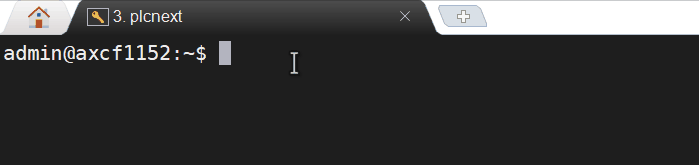
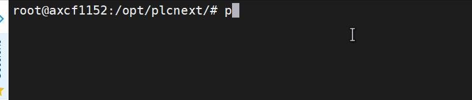
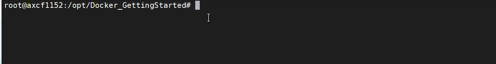

# node-red 
## important: this build will not run without an SD card addtional memory, due to Node-Red storage requirements -Minimum 2GB Memory stick for AXC F series (Part# 1043501 or 1061701)

### **1 Node-Red installation**

Requirements
  * Internet connection to the PLC
  * Understating of PLC Web page management
  * Basic knowledge on PLCnext Engineer
  * Basic knowledg on node-red
  * root User access

Supported hardware
* AXC F 1152, AXC F 2152, AXC F 3152 (**Firmware 2021.0 or later**) and BPC 1500 series. 

### **1.1 Preparing Controller**  

1. Connect the AXC F controller to Internet-Provider
2. Start the terminal on Linux OS or Shell capable software ([Putty](https://www.chiark.greenend.org.uk/~sgtatham/putty/latest.html) or [Moba](https://mobaxterm.mobatek.net/download.html)) and establish the SSH-Connection to PLC via command line "ssh admin@192.168.1.10" (your password should be set in the User authentication under WBM).
3. Change to root via "su" The root user need to be setup [root user guide](<https://github.com/plcnextusa/PLCnext-Guides/blob/master/Appendices/Appendix%204%20How%20to%20create%20a%20root%20user%20in%20SSH.pdf>)
   
4. Make sure your Internet connection is intact, via command-line ping http://google.com
   
5. Update the clock running the command below.

```bash
 date -s "$(curl -s --head http://google.com | grep ^Date: | sed 's/Date: //g')"
```
### **1.2 Installing Docker** 

After preparing the controller still as a **root** user execute the commands below.

```bash
git clone https://github.com/PLCnext/Docker_GettingStarted.git 

cd Docker_GettingStarted

chmod -c 777 setup.sh

./setup.sh
```
the Setup script will run and prompt you as below, you must select **Docker** and enter blank for the latest version.


### **1.3 Pulling Container**

After installing Docker you can pull the official node-red container by running the command below. 

```bash
root@axcf2152:~# docker run -it --restart unless-stopped -p 1880:1880 --network=host --privileged --name=mynodered nodered/node-red
```

This command will install and create your container which will run with Docker from boot by default, and if your unit is connected to the internet so should be Node-Red, allowingyou to install any contribution you desire from the interface

Also you can start and stop your Node_red container anytime by using the following commands.
```bash
root@axcf2152:~# balena-engine start mynodered
root@axcf2152:~# balena-engine stop mynodered
```


Enjoy it!
